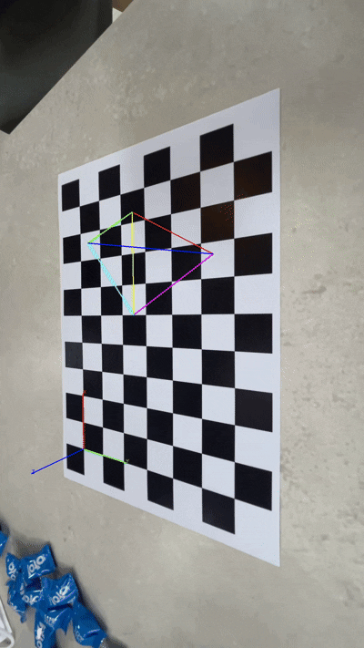

# CameraPoseEstimationAndAR

## 📁 프로젝트 개요

**카메라 캘리브레이션 결과를 활용해 체커보드 기반 카메라 포즈 추정 후, AR 요소(정사면체 + 좌표축)를 영상 위에 렌더링하는 프로젝트입니다.**

- **개발환경**
  - Python 3.10
  - OpenCV 4.9.0
- **리소스 출처**
  - 체커보드: [Calibration Checkerboard Collection](https://markhedleyjones.com/projects/calibration-checkerboard-collection)

---

## 🔍 결과 분석

이전에 캘리브레이션된 카메라 내부 파라미터를 기반으로, 이번 실습에서는 체커보드 패턴을 이용해 외부 파라미터(카메라 위치와 자세)를 추정했습니다.

이를 바탕으로 정사면체와 좌표축이 실제 체커보드 기준 위치에 정확히 투영되며, AR 객체가 3D 공간에 안정적으로 부착된 형태로 표현됩니다.

영상에서는 카메라 움직임에 따라 AR 객체가 자연스럽게 따라붙는 모습을 통해, 포즈 추정이 정확히 작동했음을 확인할 수 있습니다.

---

## 🛠️ 개선사항

| 개선 대상             | 제안 내용 |
|----------------------|-----------|
| 🧠 포즈 추정 신뢰도 표시 | 외부 파라미터의 신뢰도(예: reprojection error)를 계산해 시각적으로 피드백 |
| 🖼️ 결과물 시각 효과       | 정사면체와 좌표축에 그림자, 반투명 효과 등 추가로 더 현실감 부여 가능 |
| 🔄 카메라 이동 대응       | 빠른 이동 시 객체 흔들림 보완을 위한 필터링(EKF 등) 고려 |
| 🌀 모델 다양화           | 정사면체 외에도 큐브, 텍스트, OBJ 모델 등 지원 가능 |
| 🕹️ 인터랙션 추가         | 마우스 클릭 시 회전/이동 등의 반응 구현 가능 |
| 📦 통합 도구화           | 캘리브레이션부터 AR까지 GUI 기반 툴킷으로 통합 가능 |

